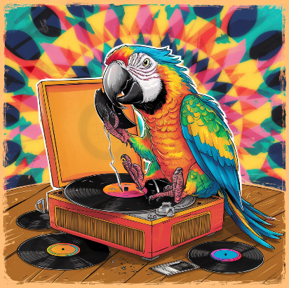

|  | <h2>Broken Record Parrot</h2>Parrot is a tool designed for the generation and analysis of synthetic deep-roleplay dialogue with LLMs.<br><br>Put simply: Parrot creates long conversations between two characters.<br><br>The results are used to drive an investigation into various LLM multi-turn conversation looping behaviors.<br><br>Tested up to 16K token, 100+ turn conversations. |
| --- | --- |

## Features

- Utilizes two separate language models for assistant and user roles
  - Assistant Model with full context length
  - User Model with (optionally) smaller context
- Supports `llama-server`, `koboldcpp` and `aphrodite-engine` for inference
- Streaming generation, read while it writes
- Automatically analyze results for repetition
- Visually compare repetition and responce lengths across models, sampler settings and inference engines

## Requirements

`pip install -r requirements.txt`

## Components

1. `parrot.py`: The main Python script that handles the dialogue generation.
2. `parrot.sh`: A Bash script for running multiple iterations of the dialogue generation and logging the results.
3. `config.json`: Configuration file for setting up the dialogue parameters.
4. `analyze.py`: A python script to parse parrot logs and identify common segments in assistant speech and compute metrics.
5. `view.py`: A streamlit application to visualize and compare results between multiple runs.

## Usage

1. Launch an inference engine for each of the two LLMs.

For `llama-server` specify the desired context size with `-c <ctx>`

For `aphrodite-engine` or `vLLM` specify the context size with `--max-model-len <ctx>`

2. Set up your configuration in `config.json`. Refer to [CONFIG.md](CONFIG.md) for detailed information on the configuration options.

3. Run a single iteration for testing:
   ```
   python parrot.py <path/config.json>
   ```

4. Run multiple iterations with logging using the bash script:
   ```
   ./parrot.sh <number_of_iterations> <path/config.json>
   ```
   Results will be written to `<parrot_date_time>/`

5. Analyze the results
   ```
   python analyze.py <parrot_date_time>
   ```

6. Visualize and compare up to 10 runs
   ```
   python view.py <parrot_date_time0> <parrot_date_time1> ... <parrot_date_time9>
   ```

   A web browser will open to display `results.html`.

## Configuration

The `config.json` file allows you to customize various aspects of the dialogue generation, including:

- Initial conversation prompts
- Character prefixes
- Token limits
- Sampling parameters
- API endpoints
- User simulation settings

For a complete breakdown of the configuration options, please refer to [CONFIG.md](CONFIG.md).

## Design Evolution

- The [v0/](v0/) folder contains an initial, different design for this application based on a single, long generation.
- The first problem hit was that --ignore-eos does not actually ignore EOS, it bans it. This forces the dialogue into a single turn which is unrealistic.
- If we apply [v0/fix-ignore-eos.patch](v0/fix-ignore-eos.patch) we see a different problem: the model will never generate a `user` turn only `assistant`
- This was end of the road for the v0 approach, it's clear that in order to generate anything resembling coherent dialogue we need to both respect EOS and manually manage conversation turns. `parrot` is born.
- original parrot had the LLM generating User: turns using same prompt as assistant turns. this didn't work past the first ~10 conversation steps, the model has no idea how to speak for user.
- parrot v1.1 split the user and assistant prompts, as well as limited the context depth of user to boost it's coherency
- even with different prompts, using same LLM for both user and assitant caused gender-inverted-looping (both characters were saying the same things, with genders flipped)
- with default repeat_penalty settings looping was observed inside longer completions. raising `repeat_last_n` solved this one.
- parrot v1.2 added support for a second LLM to act as the user, which is more realistic
- this revealed a new problem: after ~4k most models forget how to emit EOS and the conversation breaks down into romance novel word soup
- parrot v1.3 limited each turn to a single line which keeps the conversation format flowing

The current design is able to generate coherent 8k-16k token conversations.

## Looping and Breaking

Generating dialogues is fun but the motiviation for this project was to look deeper into looping and conversation breaking behaviors.

So far, the following types of loops have been identified:

- Single-turn conversation loop: User/Assistant are stuck saying the same thing to each other in alternating turns
- Multi-turn conversation loop: User/Asistant are stuck but across multiple turns
- Intra-turn repetition: LLM repeats phrases or characters inside of a single turn
- Prefix repetition: LLM responces all start with the same prefix, and that prefix often grows with time
- Semantic repetition: LLM was unable to advance the story and gets stuck re-describing the same scene with slightly different words each time.

In addition to Loops, some Breaks have also been identified:

- Word Soup: LLM forgets to emit EOS and starts writing long responces pulled from bad romance novels
- Nothing to say: LLM emits EOS immediately
- Apostrophe breaks: LLM starts to freak out whenever an ' is encountered, ending generations early or otherwise generating nonsense
- Leading whitespace: LLM accumulates more and more whitespace before it starts to respond
- Rejection: LLM decides the material is too hot and begins explicitly rejecting completions.

## References

- [CTRL paper that describes repeat_penalty sampling](https://arxiv.org/pdf/1909.05858) see section 4.1
- [OpenAI explanation of penalties](https://platform.openai.com/docs/advanced-usage/parameter-details) note that they do not support repeat_penalty
- [aphrodite-engine implementation of penalties](https://github.com/PygmalionAI/aphrodite-engine/blob/cc6c310e578c63f594bb13d6125e6ed1ba8a208e/aphrodite/modeling/layers/sampler.py#L188)
- [aphrodite-engine sampler](https://github.com/PygmalionAI/aphrodite-engine/blob/cc6c310e578c63f594bb13d6125e6ed1ba8a208e/aphrodite/modeling/layers/sampler.py#L44)
- [llama-cpp implementation of penalties](https://github.com/ggerganov/llama.cpp/blob/45f2c19cc57286eead7b232ce8028273a817aa4d/src/llama.cpp)
- [llama-cpp sampler](https://github.com/ggerganov/llama.cpp/blob/45f2c19cc57286eead7b232ce8028273a817aa4d/common/sampling.cpp#L354)

## License

[MIT](LICENSE.md)
